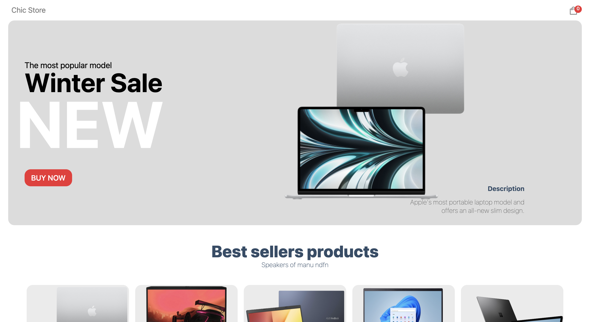
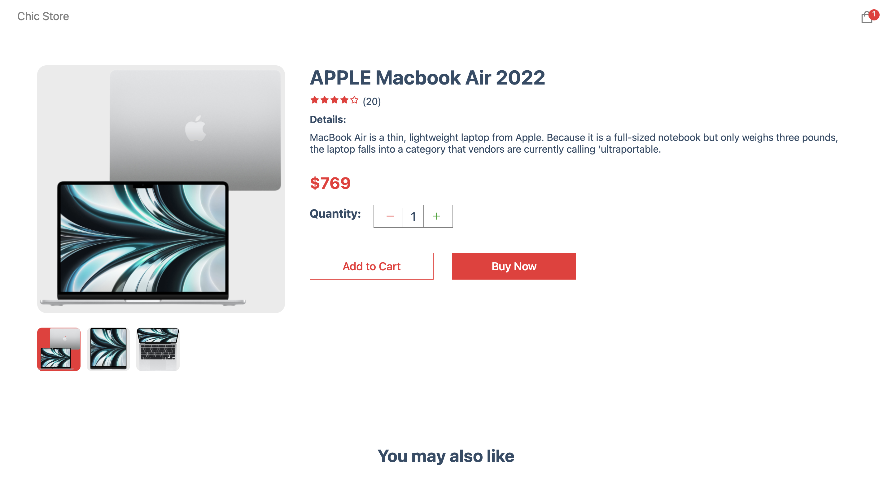
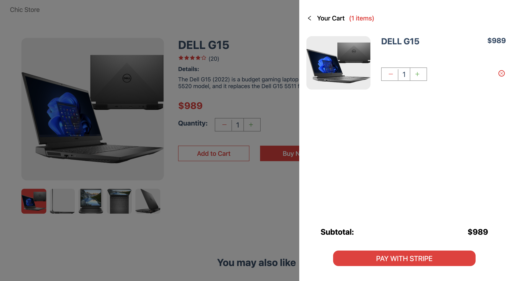

# Chic Stock🛒💻

Really amazing shopping application, that include modern design, animation and even full integration with Stripe.

## Tech Stack

**Client:** React, React Router, Stripe 

**Server:** Next JS, Sanity


## Features

- Integration with Stripe
- Sanity
- Animation


## FAQ

#### How long has it been in development?

Development took about a week


## Screenshots






## Run Locally

Clone the project

```bash
  git clone https://github.com/thatsfov1/chic-stock.git
```

Go to the project directory

```bash
  cd chic stock
```

Install dependencies

```bash
  npm install
```


